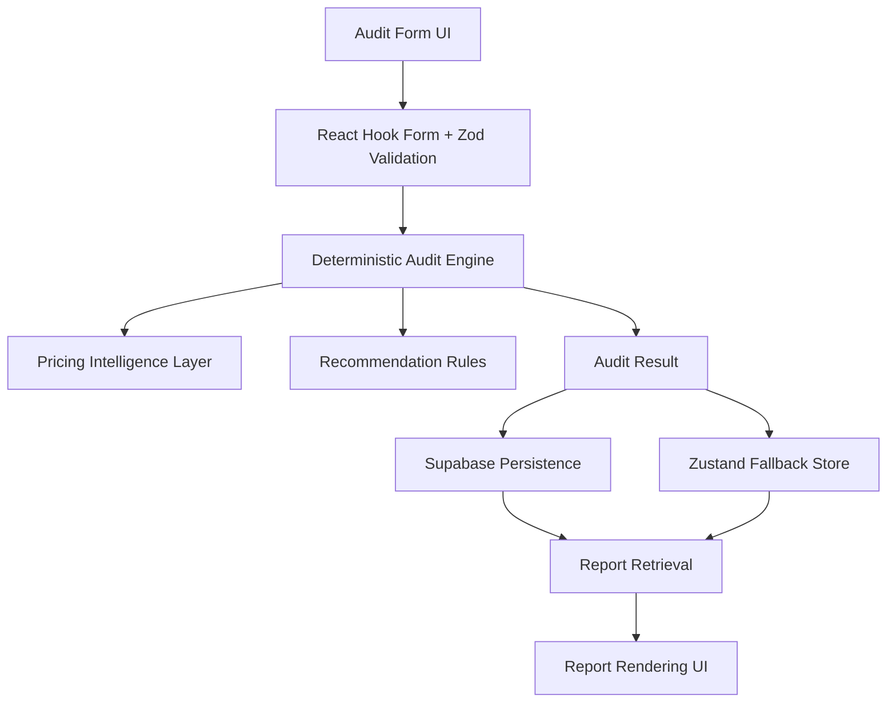

# ARCHITECTURE

## Stack

* Next.js 16
* TypeScript
* Tailwind CSS v4
* shadcn/ui
* Zustand
* Supabase
* Vitest

---

## Why This Stack

Chosen for:

* fast iteration
* type safety
* production-grade scalability
* hydration-safe frontend rendering
* lightweight state management
* SEO and Open Graph support
* strong developer experience

---

## System Flow

User Input → Validation Layer → Audit Engine → Persistence Layer → Report Rendering

---

## High-Level Architecture

---

## Planned Scaling

If scaled to 10k audits/day:

* move audit processing to background jobs
* add Redis caching
* optimize pricing lookup layer
* move report generation to async pipelines
* introduce lightweight analytics aggregation
* add rate limiting for public endpoints

The current architecture intentionally remains lightweight because the project is an MVP-focused deterministic SaaS system.

---

## Deterministic Audit Philosophy

SpendLayer intentionally avoids:

* AI-generated financial recommendations
* speculative savings claims
* random recommendation behavior
* opaque optimization logic

All recommendations are generated deterministically through:

* pricing datasets
* rule-based evaluation
* overlap analysis
* savings calculations

This guarantees:

* repeatable outputs
* explainable recommendations
* predictable testing behavior
* financially conservative recommendations

---

## Persistence Architecture

### Primary Persistence

Supabase stores:

* audit input payloads
* deterministic audit results
* report IDs
* timestamps

### Fallback Persistence

Zustand persistence remains available as a lightweight same-browser fallback path.

This architecture improves:

* durability
* refresh safety
* report shareability
* resilience during temporary persistence failures

---

## Accessibility Strategy

Accessibility improvements include:

* semantic HTML structure
* keyboard-accessible controls
* focus-visible states
* aria validation support
* screen-reader-friendly form flows

The system prioritizes practical accessibility without introducing heavy UI abstraction complexity.

---

## Reliability & Failure Handling

The system includes:

* invalid report handling
* timeout-safe persistence fetches
* graceful loading states
* Supabase fallback behavior
* environment validation safety

Failure states intentionally fail gracefully instead of rendering undefined or broken UI.

---

## Testing Strategy

The project uses Vitest for deterministic unit and integration testing.

### Coverage Includes

* pricing validation
* audit engine recommendations
* savings calculations
* form validation
* audit submission flow
* report rendering
* persistence behavior
* loading states
* stabilization logic
* failure handling

### Current Status

* 89 tests passing
* zero TypeScript build errors
* deterministic outputs verified
* responsive QA completed
* hydration warnings removed

---

## Architectural Tradeoffs

### Intentionally Chosen

* deterministic recommendations over AI-generated reasoning
* lightweight Zustand persistence over complex global state systems
* manual pricing verification over speculative scraping
* simple scalable architecture over premature microservices

### Intentionally Avoided

* enterprise RBAC systems
* websocket infrastructure
* microservice decomposition
* vector databases
* RAG pipelines
* AI agent orchestration

The architecture prioritizes:

* maintainability
* explainability
* deterministic testing
* MVP reliability
